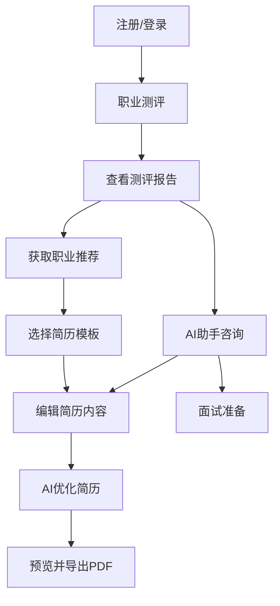

## 1. 产品概述

CareerCompass AI 是一款面向大学毕业生和失业人群的智能职业规划与简历制作平台，通过AI技术帮助用户跨越求职迷茫，设计最能体现个人优势的优质简历，并提供科学的职业规划建议。

- 核心价值：AI驱动的职业测评 + 智能简历生成 + 个性化职业规划，一站式解决求职全流程痛点
- 目标用户：应届毕业生、求职转型者、失业再就业人群，帮助其从"不知道做什么"到"拿到理想offer"

## 2. 核心功能

### 2.1 用户角色

| 角色 | 注册方式 | 核心权限 |
|------|----------|----------|
| 普通用户 | 邮箱/手机号注册 | 测评、简历制作、AI助手、职业规划 |
| 管理员 | 系统分配 | 用户管理、内容管理、数据统计 |

### 2.2 功能模块

1. **首页/落地页**: 产品介绍、核心功能展示、用户引导、快速开始入口
2. **注册/登录页**: 邮箱注册、登录、密码找回
3. **用户仪表盘**: 个人概览、快捷操作、最近活动、数据统计
4. **职业测评中心**: MBTI性格测评、霍兰德职业兴趣测评、能力评估、测评报告
5. **简历编辑器**: 多模板选择、模块化编辑、AI内容生成、实时预览、PDF导出
6. **职业规划**: 职业路径推荐、技能差距分析、发展建议
7. **AI智能助手**: 对话式问答、简历优化建议、面试准备、职业咨询

### 2.3 页面详情

| 页面名称 | 模块名称 | 功能描述 |
|----------|----------|----------|
| 首页 | Hero区域 | 品牌标语、动态背景、CTA按钮引导注册 |
| 首页 | 功能展示 | 三大核心功能卡片（测评/简历/AI助手） |
| 首页 | 用户证言 | 成功案例展示、用户评价轮播 |
| 注册/登录 | 表单区域 | 邮箱/密码注册登录、表单验证、错误提示 |
| 仪表盘 | 概览卡片 | 简历数量、测评完成度、AI使用次数 |
| 仪表盘 | 快捷操作 | 创建简历、开始测评、咨询AI |
| 仪表盘 | 最近活动 | 最近编辑的简历、测评记录时间线 |
| 测评中心 | 测评选择 | MBTI/霍兰德/能力评估入口卡片 |
| 测评中心 | 答题界面 | 逐题作答、进度条、计时器 |
| 测评中心 | 测评报告 | 雷达图、性格分析、职业推荐、发展建议 |
| 简历编辑器 | 模板选择 | 模板缩略图预览、分类筛选 |
| 简历编辑器 | 模块编辑 | 基本信息/教育/工作/项目/技能模块编辑 |
| 简历编辑器 | AI生成 | 一键AI优化、内容生成、措辞改进 |
| 简历编辑器 | 实时预览 | 右侧简历预览、缩放控制 |
| 简历编辑器 | 导出功能 | PDF导出、格式选择 |
| 职业规划 | 路径推荐 | 基于测评结果的职业方向推荐 |
| 职业规划 | 技能分析 | 当前技能与目标岗位差距可视化 |
| 职业规划 | 发展建议 | 学习路径、证书推荐、时间规划 |
| AI助手 | 对话界面 | 多轮对话、快捷问题、流式响应 |
| AI助手 | 功能面板 | 简历优化、面试准备、职业咨询快捷入口 |

## 3. 核心流程

用户注册后，首先完成职业测评了解自身优势，然后基于测评结果获得职业方向推荐，接着使用AI驱动的简历编辑器制作专业简历，全程可咨询AI助手获取个性化建议。

## 4. 用户界面设计

### 4.1 设计风格

- 主色调：深靛蓝(#1e3a5f) + 活力橙(#ff6b35)，传达专业与活力
- 辅助色：浅灰背景(#f8f9fc)、白色卡片、绿色成功状态
- 按钮风格：圆角(8px)、渐变主按钮、描边次要按钮
- 字体：标题使用粗体无衬线、正文使用常规无衬线
- 布局风格：左侧导航 + 内容区域，卡片式布局
- 图标风格：线性图标(lucide-react)，统一2px描边
- 动效：页面切换淡入、卡片悬浮微动、按钮点击反馈

### 4.2 页面设计概览

| 页面名称 | 模块名称 | UI元素 |
|----------|----------|--------|
| 首页 | Hero区域 | 渐变背景、大标题、CTA按钮、装饰图形动画 |
| 首页 | 功能展示 | 三列卡片、图标、悬浮阴影效果 |
| 仪表盘 | 概览区域 | 统计卡片网格、进度环形图、渐变图标背景 |
| 测评中心 | 答题界面 | 居中卡片、选项按钮组、顶部进度条 |
| 测评中心 | 测评报告 | 雷达图、标签云、推荐卡片列表 |
| 简历编辑器 | 编辑区域 | 左侧模块导航、中间编辑表单、右侧实时预览 |
| AI助手 | 对话界面 | 气泡消息、打字动画、快捷问题标签 |

### 4.3 响应式设计

- 桌面优先设计，最小宽度1024px
- 平板适配(768-1024px)：简历编辑器切换为上下布局
- 移动端适配(<768px)：单列布局，底部导航栏
- 触摸优化：按钮最小44px点击区域，滑动操作支持
