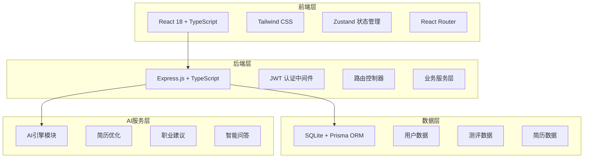
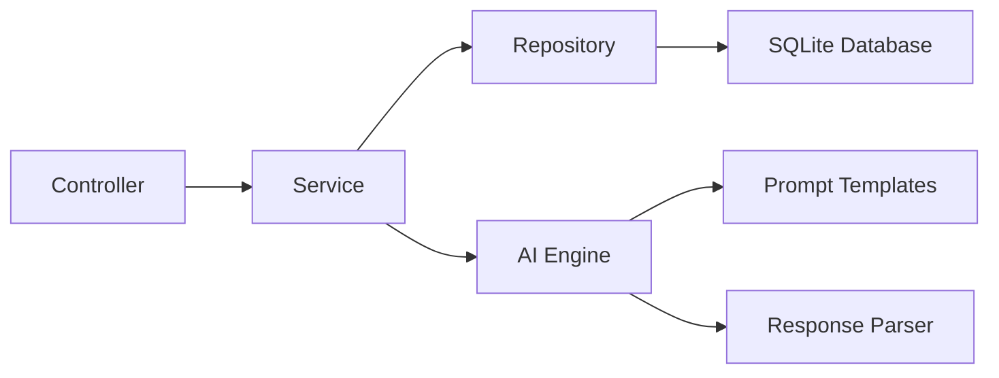
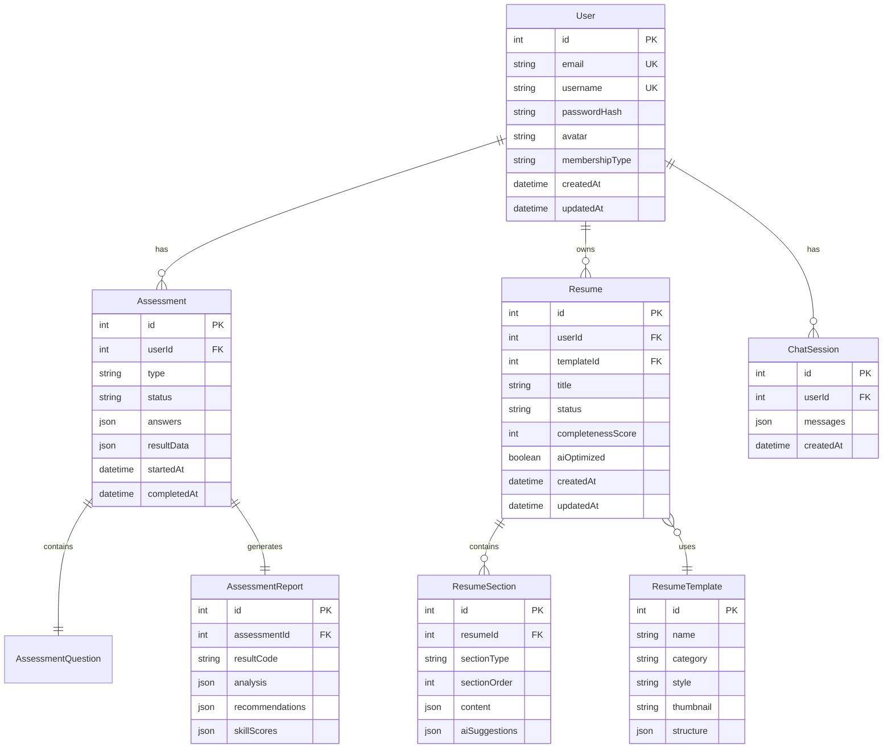

## 1. 架构设计



## 2. 技术说明

- 前端：React@18 + TailwindCSS@3 + Vite + Zustand + React Router
- 初始化工具：vite-init (react-express-ts 模板)
- 后端：Express@4 + TypeScript (ESM格式)
- 数据库：SQLite + Prisma ORM
- AI服务：内置AI引擎模块（可扩展接入OpenAI/文心一言等大模型API）
- 认证：JWT Token (access + refresh)
- 图表：Recharts
- PDF导出：html2pdf.js

## 3. 路由定义

| 路由 | 用途 |
|------|------|
| / | 首页/落地页 |
| /login | 登录页 |
| /register | 注册页 |
| /dashboard | 用户仪表盘 |
| /assessment | 测评中心 |
| /assessment/:type | 具体测评答题 |
| /assessment/:id/report | 测评报告 |
| /resume | 简历列表 |
| /resume/new | 创建简历 |
| /resume/:id/edit | 简历编辑器 |
| /career | 职业规划 |
| /ai-assistant | AI助手 |

## 4. API定义

### 4.1 认证相关

```typescript
POST /api/auth/register
  Body: { email: string; password: string; username: string }
  Response: { user: User; tokens: { accessToken: string; refreshToken: string } }

POST /api/auth/login
  Body: { email: string; password: string }
  Response: { user: User; tokens: { accessToken: string; refreshToken: string } }

POST /api/auth/refresh
  Body: { refreshToken: string }
  Response: { accessToken: string }

GET /api/auth/me
  Headers: Authorization: Bearer <token>
  Response: User
```

### 4.2 测评相关

```typescript
GET /api/assessments/types
  Response: AssessmentType[]

POST /api/assessments/start
  Body: { type: 'mbti' | 'holland' | 'competency' }
  Response: AssessmentRecord

POST /api/assessments/:id/answer
  Body: { questionId: number; answer: string | number }
  Response: { nextQuestion: Question | null; progress: number }

POST /api/assessments/:id/complete
  Response: AssessmentReport

GET /api/assessments/:id/report
  Response: AssessmentReport

GET /api/assessments/history
  Response: AssessmentRecord[]
```

### 4.3 简历相关

```typescript
GET /api/resumes
  Response: Resume[]

POST /api/resumes
  Body: { title: string; templateId: number }
  Response: Resume

GET /api/resumes/:id
  Response: ResumeDetail

PUT /api/resumes/:id
  Body: { title?: string; sections?: ResumeSection[] }
  Response: Resume

DELETE /api/resumes/:id
  Response: { success: boolean }

POST /api/resumes/:id/ai-generate
  Body: { sectionType: string; prompt: string }
  Response: { content: any; suggestions: string[] }

POST /api/resumes/:id/ai-optimize
  Body: { sectionType: string; content: any }
  Response: { optimizedContent: any; suggestions: string[] }

GET /api/resumes/:id/score
  Response: { score: number; details: ScoreDetail[] }

GET /api/resume-templates
  Response: ResumeTemplate[]
```

### 4.4 AI助手相关

```typescript
POST /api/ai/chat
  Body: { message: string; sessionId?: string }
  Response: { reply: string; sessionId: string }

GET /api/ai/career-advice
  Query: { assessmentId: string }
  Response: CareerAdvice
```

### 4.5 职业规划相关

```typescript
GET /api/career/recommendations
  Query: { assessmentId?: string }
  Response: CareerRecommendation[]

GET /api/career/skill-analysis
  Query: { targetPosition: string }
  Response: SkillAnalysis
```

## 5. 服务端架构图



## 6. 数据模型

### 6.1 数据模型定义



### 6.2 数据定义语言

```sql
CREATE TABLE users (
    id INTEGER PRIMARY KEY AUTOINCREMENT,
    email TEXT NOT NULL UNIQUE,
    username TEXT NOT NULL UNIQUE,
    password_hash TEXT NOT NULL,
    avatar TEXT,
    membership_type TEXT DEFAULT 'free',
    created_at DATETIME DEFAULT CURRENT_TIMESTAMP,
    updated_at DATETIME DEFAULT CURRENT_TIMESTAMP
);

CREATE TABLE assessments (
    id INTEGER PRIMARY KEY AUTOINCREMENT,
    user_id INTEGER NOT NULL REFERENCES users(id),
    type TEXT NOT NULL,
    status TEXT DEFAULT 'in_progress',
    answers TEXT DEFAULT '[]',
    result_data TEXT,
    started_at DATETIME DEFAULT CURRENT_TIMESTAMP,
    completed_at DATETIME
);

CREATE TABLE assessment_reports (
    id INTEGER PRIMARY KEY AUTOINCREMENT,
    assessment_id INTEGER NOT NULL UNIQUE REFERENCES assessments(id),
    result_code TEXT,
    analysis TEXT,
    recommendations TEXT,
    skill_scores TEXT
);

CREATE TABLE resumes (
    id INTEGER PRIMARY KEY AUTOINCREMENT,
    user_id INTEGER NOT NULL REFERENCES users(id),
    template_id INTEGER REFERENCES resume_templates(id),
    title TEXT NOT NULL,
    status TEXT DEFAULT 'draft',
    completeness_score INTEGER DEFAULT 0,
    ai_optimized INTEGER DEFAULT 0,
    created_at DATETIME DEFAULT CURRENT_TIMESTAMP,
    updated_at DATETIME DEFAULT CURRENT_TIMESTAMP
);

CREATE TABLE resume_sections (
    id INTEGER PRIMARY KEY AUTOINCREMENT,
    resume_id INTEGER NOT NULL REFERENCES resumes(id) ON DELETE CASCADE,
    section_type TEXT NOT NULL,
    section_order INTEGER DEFAULT 0,
    content TEXT NOT NULL DEFAULT '{}',
    ai_suggestions TEXT
);

CREATE TABLE resume_templates (
    id INTEGER PRIMARY KEY AUTOINCREMENT,
    name TEXT NOT NULL,
    category TEXT NOT NULL,
    style TEXT NOT NULL,
    thumbnail TEXT,
    structure TEXT NOT NULL
);

CREATE TABLE chat_sessions (
    id INTEGER PRIMARY KEY AUTOINCREMENT,
    user_id INTEGER NOT NULL REFERENCES users(id),
    messages TEXT DEFAULT '[]',
    created_at DATETIME DEFAULT CURRENT_TIMESTAMP
);

CREATE INDEX idx_assessments_user ON assessments(user_id);
CREATE INDEX idx_resumes_user ON resumes(user_id);
CREATE INDEX idx_resume_sections_resume ON resume_sections(resume_id);
CREATE INDEX idx_chat_sessions_user ON chat_sessions(user_id);
```
